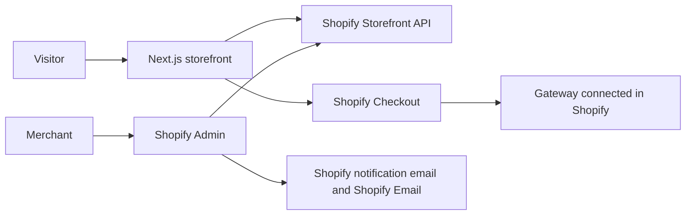

# Architecture

Accepted in [ADR 0001](adr/0001-shopify-as-system-of-record.md).

## Shape

Crue is a Next.js storefront (App Router, TypeScript) that reads Shopify and sends the buyer to Shopify Checkout. There is no application API in v1. Shopify is the CMS, the commerce engine, the payment host, the order system, and the admin.

## What this repo owns

- The responsive UI, including the intro sequence.
- Routing, presentation, and client state for browsing and cart setup.
- Queries to the Storefront API for products, collections, cart, pages, and metaobjects.
- The handoff to the checkout URL Shopify returns.
- Jest tests that prove storefront behavior described in an accepted requirement.

## What Shopify owns

- Products, variants, inventory, collections, pricing, and discounts.
- Cart creation through the Storefront API, then payment, tax, and shipping on hosted checkout.
- Orders, fulfillments, and the transactional mail tied to them (order confirmation, shipping).
- Customer records. If accounts are added later, they use Shopify customer accounts, not a local user table.
- Page and metaobject content. Editors change copy and structured entries in Shopify Admin. The storefront renders them.
- Payment method configuration. The storefront never talks to Midtrans, Xendit, PayPal, or a card network.

## Payments from Indonesia

Shopify Payments is not available for an Indonesian merchant. Checkout still runs on Shopify. Local methods (cards, virtual account, QRIS, e-wallets) come from a gateway app installed in the admin, typically Midtrans or Xendit. PayPal remains the usual path for overseas cards. Which gateway Crue uses is open.

Shopify also charges its own transaction fee on top of the gateway when Shopify Payments is not used. The rate depends on the Shopify plan. That fee is a business cost, not something the storefront calculates.

## Content

V1 content is Shopify pages plus metaobjects exposed to the Storefront API. A section on the home page is a metaobject the storefront already knows how to render. Editors can change fields. They cannot invent a new layout without a code change. That limit is acceptable while Crue is an indie team editing occasionally. A separate CMS is a new ADR, not a silent addition.

## Intro sequence

On the first visit, the site shows a fullscreen CSS sequence before the page underneath. It is not a video and not a WebGL scene. The timeline is in [design/DESIGN.md](design/DESIGN.md). The screens are [design/screens/dark/intro-desktop.html](design/screens/dark/intro-desktop.html) and [design/screens/dark/intro-mobile.html](design/screens/dark/intro-mobile.html).

- A control skips it. It does not dismiss itself. It waits for Enter.
- `prefers-reduced-motion` shows the final still state: the mark, the wordmark, and Enter.
- A cookie remembers that the visitor has seen it. A refresh does not play it again.
- There is no separate intro video or poster file.

Brand files for screens live in [`design/brand/`](design/brand/). The earlier SVGs live in [`assets/brand/`](../assets/brand/README.md). They are not wired into a page until a requirement says so.

## Email

- Shipment and order mail: Shopify notifications, triggered when the order or fulfillment changes in Shopify.
- Newsletter: Shopify Email, with the signup captured into Shopify customers. A tool such as Klaviyo is out of scope until a requirement replaces this.

## Code layout

`app/` is the route map and nothing else. A `page.tsx` is a URL. A folder under `app/` is a URL segment, so `app/products/[handle]/page.tsx` is `/products/...` when that route exists. Screens and helpers do not go in `app/`, or a folder there becomes a public path.

- `components/<screen>/` holds that screen and the Jest file that proves it.
- `lib/` holds storefront helpers that are not UI.
- Tests for `app/page.tsx` and `app/layout.tsx` stay beside those files.
- Import from those folders with `@/`.

## Runtime and tests

- The storefront is Next.js 16 on the App Router, at the latest stable patch when the app is added. On 2026-09-29 that patch is 16.3.6. A later 16.3 stable patch replaces it. Canary and the 15 line do not.
- Styling is Tailwind CSS 4, at the latest stable 4.3 patch when the app is added. On 2026-09-29 that patch is 4.3.3. Component layout and color live in utility classes. The only handwritten CSS file is the Tailwind entry. CSS modules, a second styling library, and per-component stylesheets do not.
- The package manager is chosen when the first accepted requirement adds the app, and recorded on that requirement.
- Jest is the test runner. A test name or description includes the requirement id it proves, for example `REQ-003`.
- Tests cover storefront rules (intro session, empty states, API mapping). They do not re-test Shopify Checkout.
- Secrets: the Storefront API public token may ship to the browser. Any Admin API token stays on the server and is out of v1 unless a requirement needs it. Tokens never go in git.

## Environments

Expected later, not created yet:

- A Shopify development store.
- `SHOPIFY_STORE_DOMAIN` and `SHOPIFY_STOREFRONT_ACCESS_TOKEN` in `.env.local`.

## Explicit non-goals in code

No custom admin routes. No payment SDK. No order database. No duplicate product catalog. If a feature needs one of those, stop and write an ADR.
